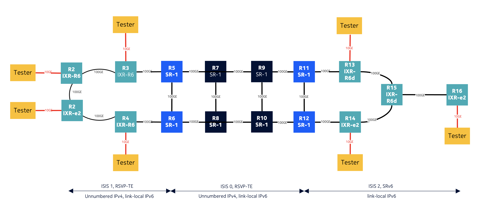
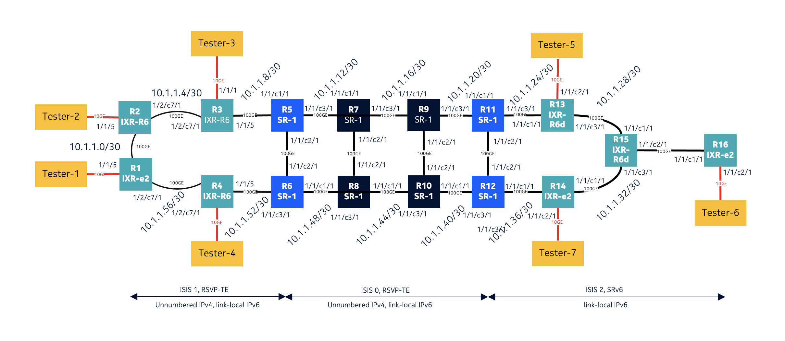

# Nokia Lab for SRv6
This is a Nokia Lab for SRv6 interworking with RSVP for Epipe services



## Getting Started

Topology file is included in this repo.

```
sudo containerlab deploy -t srv6.topo.clab.yml
```

Make sure you have updated/uploaded Nokia SROS License File in the location as mentioned in the license section of the topology file.

## Physical Topology 


